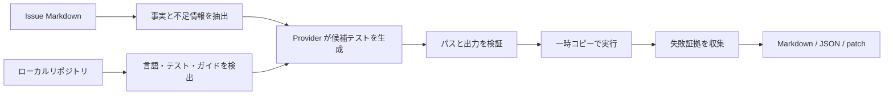

# ReproProof

**不完全なバグ報告を、構造化された分析・確認可能な失敗テストのパッチ・実行証拠へ変換します。再現できていない不具合を「再現済み」とは報告しません。**

ReproProof は、Issue の文章から再現手順や失敗テストを作る作業に時間を使っている OSS メンテナー向けの、ローカルファーストな CLI / GitHub Action です。修正 PR の自動生成を主目的にせず、修正前に必要な証拠を作ります。

> リリース候補です。Node.js と Python の管理された fixture で動作し、公開 GitHub CI も稼働していますが、外部利用実績は主張しません。また、ローカル実行は強化された OS サンドボックスではありません。

## 5分で試す

Node.js 22 以上と Corepack が必要です。Python fixture のみ Python と pytest が必要です。

```bash
corepack pnpm install
corepack pnpm build
corepack pnpm demo
```

Mock Provider を使うため API キー・課金・外部通信は不要です。デモは信頼済み fixture 用の `--unsafe-local-execute` を明示的に使います。未知のリポジトリでは使用しないでください。結果は `.reproproof/demo/` の `report.md`、`report.json`、`candidate.patch` に保存されます。

## 処理フロー



## v0.1 の対応範囲

- TypeScript / JavaScript、Python
- node:test、Jest、Vitest、pytest
- Mock、ループバックの OpenAI 互換ローカル API、OpenAI API、Anthropic API
- Markdown / JSON レポート、unified diff パッチ
- CLI、GitHub Action のサンプル

クラウド Provider は `--allow-external` を明示しない限り利用できません。Mock がデフォルトです。テレメトリー、自動マージ、暗黙の Draft PR 作成はありません。

## セキュリティ上の注意

Issue、README、ソース、コメント、モデル出力はすべて信頼できない入力です。Issue 内のコマンドは実行せず、言語アダプターが許可済みの引数配列を選択します。子プロセスには API キーや GitHub Token を渡しません。

通常の `--execute` は Docker を使い、ネットワーク禁止、read-only、capability 削除、PID/CPU/メモリ制限、512 MB tmpfs を適用します。`--unsafe-local-execute` はこれらを迂回するため、信頼済み fixture の開発時だけ使用してください。詳細は [SECURITY.md](SECURITY.md) と [脅威モデル](docs/threat-model.md) を参照してください。

## 現在の制限

- 誤った理由で失敗するテストを完全には判定できません。
- Docker と Draft PR は実装済みですが、このホストでは外部インフラに対する実動検証が未完了です。
- Composite Action には公開ランナー上のクロスプラットフォーム smoke job があり、成功後にのみ v0.1.0 をタグ付けします。
- ベンチマークは管理された 2 fixture のみで、一般性能を示しません。

## 開発

```bash
corepack pnpm lint
corepack pnpm typecheck
corepack pnpm test
corepack pnpm build
```

参加方法は [CONTRIBUTING.md](CONTRIBUTING.md)、計画は [ROADMAP.md](ROADMAP.md)、利用実績は [docs/adoption.md](docs/adoption.md) に記録します。

Apache-2.0 License。
