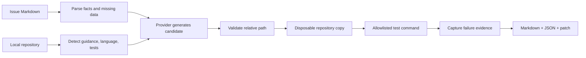

# ReproProof

**Turn an incomplete bug report into a structured diagnosis, a reviewable failing-test patch, and execution evidence—without pretending the bug was reproduced when it was not.**

ReproProof is for open-source maintainers who spend time translating issue prose into an actionable reproduction. Unlike issue-to-PR coding agents, it stops before the fix: maintainers receive missing-information questions, assumptions, a candidate test, exact execution evidence, Markdown/JSON reports, and a patch they can inspect.

> Release-candidate status: the offline MVP works on controlled Node and Python fixtures. Public GitHub CI is active, but no external adoption is claimed and local execution is not a hardened security sandbox.

[日本語 README](README.ja.md) · [Architecture](docs/architecture.md) · [Security](SECURITY.md) · [Roadmap](ROADMAP.md)

## Try it in under five minutes

Prerequisites: Node.js 22 or later and Corepack. Python plus pytest is needed only for the Python fixture.

```bash
corepack pnpm install
corepack pnpm build
corepack pnpm demo
```

The demo uses the offline mock provider and an intentionally buggy, repository-owned fixture. It makes no API call and costs nothing. It explicitly uses the unsafe local runner so Docker is not required; do not use that flag with an untrusted repository. Inspect:

```text
.reproproof/demo/report.md
.reproproof/demo/report.json
.reproproof/demo/candidate.patch
```

Expected summary:

```json
{
  "status": "reproduced",
  "confidence": "high",
  "patch": ".reproproof/demo/candidate.patch"
}
```

Here “reproduced” means the generated candidate failed on the fixture’s base version. It does not mean ReproProof proved the root cause or validated a fix.

## How it works



## Use your own local issue

Start in analysis-only mode:

```bash
node packages/cli/dist/index.js \
  --repo /path/to/project \
  --issue /path/to/issue.md \
  --provider mock \
  --output .reproproof/latest
```

Build the pinned sandbox once, then use `--execute` for networkless, resource-limited execution:

```bash
corepack pnpm sandbox:build
node packages/cli/dist/index.js --repo ./project --issue ./issue.md --provider mock --execute
```

Mock mode expects a deterministic fenced candidate used for fixtures and CI:

````markdown
```javascript reproproof:path=test/reproduction.test.js
// failing test candidate
```
````

Real model providers can propose that block automatically:

```bash
# Repository context leaves this machine; explicit consent is required.
OPENAI_API_KEY=... node packages/cli/dist/index.js \
  --repo ./project --issue ./issue.md \
  --provider openai --allow-external

# Loopback-only local endpoint; no public-cloud fallback.
node packages/cli/dist/index.js \
  --repo ./project --issue ./issue.md \
  --provider local --local-base-url http://127.0.0.1:11434/v1
```

Public GitHub issue input requires explicit network permission. Draft PR creation requires a second write confirmation, a verified reproduction, and a minimally scoped token:

```bash
GITHUB_TOKEN=... node packages/cli/dist/index.js \
  --repo ./project \
  --issue-url https://github.com/OWNER/PROJECT/issues/123 \
  --allow-network --provider local --execute \
  --draft-pr --confirm-github-write
```

The write flow creates a new branch and Draft PR only. It has no approval or merge operation. Review the target repository and generated test before enabling it.

## Supported in v0.1

| Area | Support |
|---|---|
| Languages | TypeScript/JavaScript repositories; Python repositories |
| Test frameworks | node:test, Jest, Vitest, pytest |
| Providers | deterministic mock, loopback OpenAI-compatible/Ollama-style, OpenAI, Anthropic |
| Inputs | local Markdown or opt-in public GitHub issue URL, plus local repository |
| Outputs | Markdown report, JSON report, unified-diff candidate patch |
| Automation | CLI and composite GitHub Action example |
| Platforms | developed on Windows; Linux CI configuration included |

Adapters are small packages and can be added without coupling provider code to core orchestration.

## Security model

Issue text, repository files, comments, and model output are treated as untrusted. ReproProof does not execute issue-supplied commands. The language adapter selects an argv array from an executable allowlist, `shell` is disabled, child environments exclude API/GitHub credentials, paths are containment-checked, common secrets are masked, output is bounded, and disposable copies are removed. Normal `--execute` uses Docker with network disabled, a read-only filesystem, dropped capabilities, no-new-privileges, PID/CPU/memory limits, and a 512 MB tmpfs write ceiling.

`--unsafe-local-execute` bypasses those Docker controls and exists only for trusted development fixtures. See [the threat model](docs/threat-model.md) and [privacy behavior](docs/privacy.md).

## Current limitations

- Candidate semantic validation can still accept a test that fails for the wrong reason.
- Dependency installation is not automated inside reproduction runs.
- Docker and Draft PR paths are implemented but not live-validated against external infrastructure on this host.
- The composite Action has a cross-platform public-runner smoke job; v0.1.0 will be tagged only after it passes.
- There are two controlled fixtures, not a representative benchmark.
- Cloud-provider implementations require live opt-in testing and may need API-schema updates over time.

## Development

```bash
corepack pnpm lint
corepack pnpm typecheck
corepack pnpm test
corepack pnpm build
```

The test suite includes unit, integration, and Node/Python E2E reproduction tests. See [CONTRIBUTING.md](CONTRIBUTING.md) for setup and extension points.

## Roadmap

1. Live-validate, scan, and digest-pin Docker/OCI isolation; expand wrong-reason failure classification.
2. Live-validate opt-in GitHub URL and Draft PR flows with minimal permissions.
3. Run an openly licensed, representative benchmark and three maintainer pilots.

Detailed 30/60/90-day goals and actuals are in [ROADMAP.md](ROADMAP.md). Adoption is tracked without invented numbers in [docs/adoption.md](docs/adoption.md).

## License

Apache-2.0. See [LICENSE](LICENSE).
