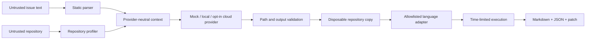

# Architecture

## Package boundaries

- `packages/core`: issue parsing, repository profiling, security boundaries, execution, report generation, orchestration.
- `packages/cli`: user interface and explicit cloud-data consent gate.
- `packages/provider-*`: provider-specific protocols; none are imported by core.
- `packages/language-*`: test-command selection. Adapters return argument arrays, never shell strings.
- `action.yml`: composite GitHub Action wrapper.

## Trust boundaries

Issue prose, source, repository guidance, model output, file paths, and process output are untrusted. The provider may propose text and one relative file; it cannot choose an arbitrary shell command. Execution receives a minimal environment, and output is secret-masked before reporting.

## Current isolation level

Normal CLI execution runs the adapter command in a Docker container with network disabled, read-only mounts, no inherited secrets, dropped capabilities, non-root UID, PID/CPU/memory limits, bounded tmpfs, an allowlist, a host timeout, and cleanup. The implementation is not yet live-validated because Docker is unavailable on the initial Windows host. An explicitly named unsafe local mode exists only for controlled development fixtures.
